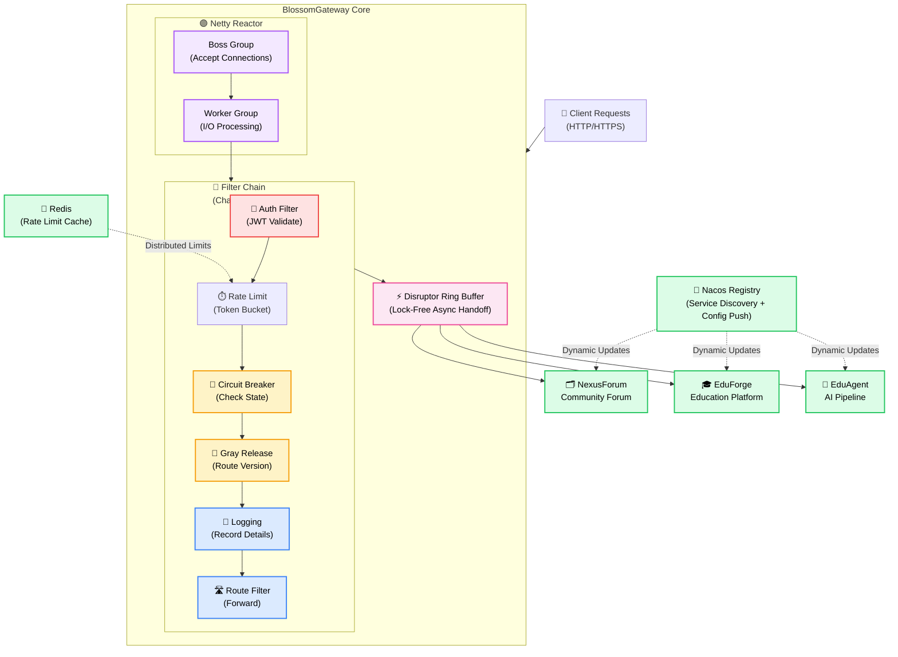
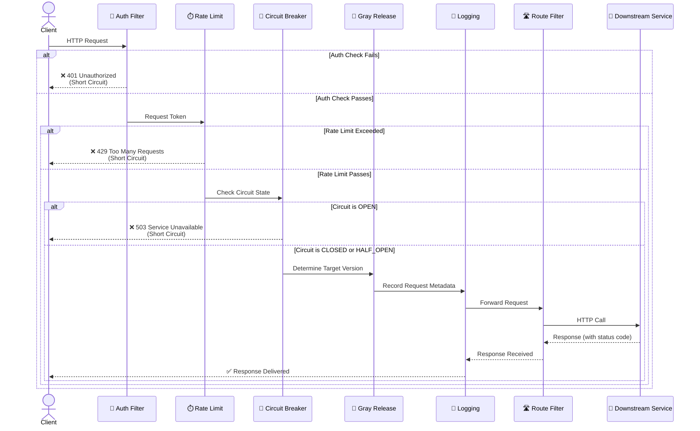
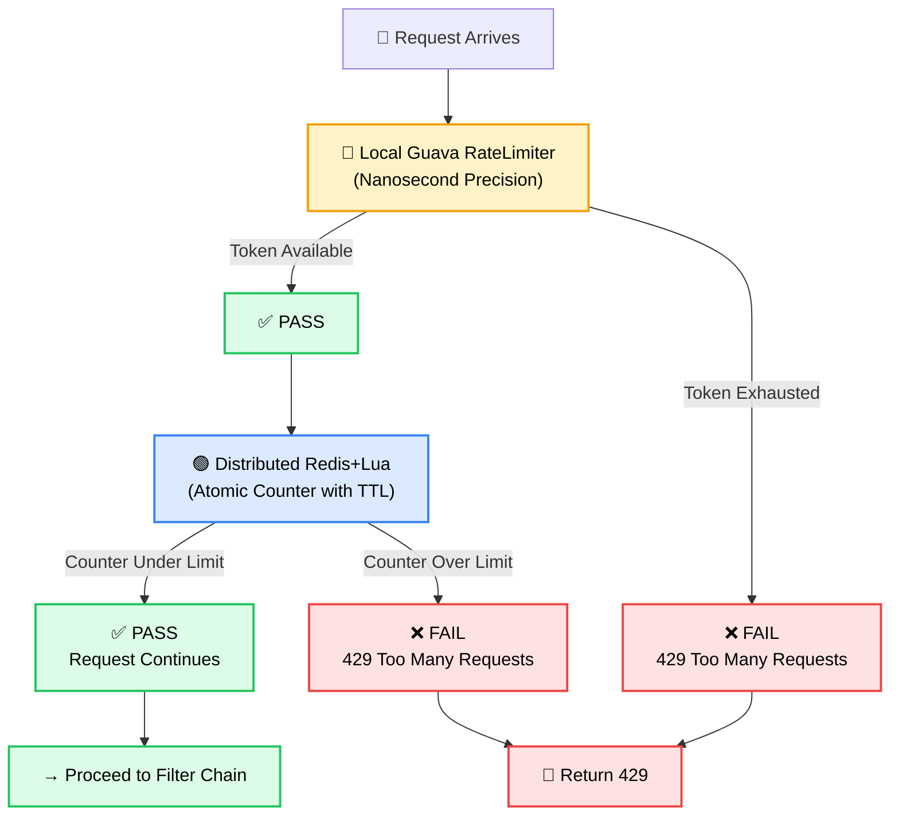

<p align="center">
  
  
  
  
  
</p>

<h1 align="center">BlossomGateway</h1>

<p align="center">
  <b>High-performance API gateway built on Netty — Zero-copy request pipelines with Disruptor and dynamic routing via Nacos</b>
</p>

<p align="center">
  <a href="#-architecture">Architecture</a> •
  <a href="#-features">Features</a> •
  <a href="#-design-decisions">Design Decisions</a> •
  <a href="#-quick-start">Quick Start</a> •
  <a href="#-module-structure">Modules</a> •
  <a href="#-related-projects">Related Projects</a> •
  <a href="#-中文说明">中文说明</a>
</p>

---

## 💡 Why Build a Gateway From Scratch?

Commercial gateways (Spring Cloud Gateway, Kong) are powerful but opaque. Building one from Netty up delivers **deep engineering understanding** of:

- **Reactor Threading Model**: Boss group accepts connections; worker group handles I/O. Non-blocking end-to-end with mechanical sympathy for CPU cache lines.
- **Zero-Copy Request Pipelines**: LMAX Disruptor ring buffer eliminates lock contention during peak traffic. Handles spikes without thread thrashing.
- **Dynamic Service Discovery**: Nacos push model vs pull model. Understanding consistency guarantees when service instances appear/disappear.
- **Distributed Rate Limiting**: Redis + Lua script atomicity guarantees. Local token bucket for burst handling, global counters for fairness.
- **Cascading Failure Prevention**: Circuit breaker state machines, timeout handling, fallback strategies.

BlossomGateway serves as the **unified traffic entry point** for Java microservice clusters like [NexusForum](https://github.com/HongdiHe/nexus-forum), [EduForge](https://github.com/HongdiHe/eduforge), and [EduAgent](https://github.com/HongdiHe/edu-agent).

---

## 🏗 Architecture

### Full Gateway Architecture



---

### Filter Chain Request Flow



---

### Rate Limiting Dual Mode Flow



---

## ✨ Features

| Feature | Implementation |
|---------|---------------|
| **Boss-Worker Reactor** | Netty `NioEventLoopGroup`: boss thread accepts connections; worker threads handle all I/O. Non-blocking throughout. No thread pool for request processing. |
| **6-Stage Filter Chain** | Chain-of-responsibility pattern: Auth → Rate Limit → Circuit Breaker → Gray Release → Logging → Routing. Each filter is pluggable. |
| **Disruptor Queue** | LMAX Disruptor ring buffer for lock-free async request handoff. Single-writer principle eliminates contention. Handles traffic spikes gracefully. |
| **Dual Rate Limiting** | **Local**: Guava `RateLimiter` (token bucket, nanosecond precision). **Distributed**: Redis + Lua script (atomic counter with TTL). Combined for burst + fairness. |
| **Circuit Breaker** | Resilience4j integration with configurable thresholds. Protects downstream services from cascading failures. Half-open state for recovery probes. |
| **Dynamic Routing** | Nacos config push model — route rule changes take effect without restart. Service endpoint updates are applied in real time. |
| **Service Discovery** | Nacos client auto-detects service instances and health status. Unhealthy nodes are removed; new nodes are registered dynamically. |
| **Async HTTP Client** | Netty-based async HTTP client for downstream calls. No blocking threads; callbacks driven by Netty event loop. |

---

## 🎯 Design Decisions

| Decision | Rationale |
|----------|-----------|
| **Netty over java.nio** | Netty abstracts `Selector` complexity, manages `ByteBuffer` allocation, provides a proven handler pipeline architecture. Production-hardened for years. |
| **Disruptor over BlockingQueue** | Lock-free ring buffer = no thread contention at high throughput. Mechanical sympathy: single-writer prevents cache-line invalidation. Latency percentiles dramatically lower. |
| **Dual rate limiting** | Local limiter handles burst spikes instantly (no network round-trip). Distributed limiter ensures global fairness across gateway instances. Combination gives low latency + correctness. |
| **Resilience4j over Hystrix** | Lighter footprint, functional API (lambda-friendly), actively maintained. Hystrix is in maintenance mode at Netflix. State machine clearer. |
| **Nacos over Eureka** | Push-based updates (lower latency), built for cloud-native. Supports both CP and AP modes. Better integration with modern Java ecosystem. |

---

## 🚀 Quick Start

### Prerequisites
- Java 17+
- Maven 3.6+
- Nacos 2.x running (optional for local testing)

### Installation & Run

```bash
# Clone repository
git clone https://github.com/HongdiHe/blossom-gateway.git
cd blossom-gateway

# (Optional) Start Nacos locally
# docker run -d --name nacos -p 8848:8848 \
#   -e MODE=standalone nacos/nacos-server:latest

# Build
mvn clean package -DskipTests

# Run gateway server
java -jar gateway-http-server/target/gateway-http-server-1.0.jar
```

Gateway listens on `http://localhost:8888` by default. Routes configured via `config.yaml` or Nacos.

---

## 📁 Module Structure

```
blossom-gateway/
├── gateway-common/                 # Shared utilities, constants, exception handling
│   └── Provides: dto, enum, exception classes for all modules
│
├── gateway-config-center/          # Configuration management via Nacos
│   ├── gateway-config-center-api/  # Config API interface (pull/push)
│   └── gateway-config-center-nacos-impl/  # Nacos implementation
│
├── gateway-register-center/        # Service discovery & health check
│   ├── gateway-register-center-api/  # Registry API interface
│   └── gateway-register-center-nacos-impl/  # Nacos implementation
│
├── gateway-http-core/              # Core engine (the heart)
│   ├── Filter chain implementation
│   ├── Disruptor event handler
│   ├── Router & load balancer
│   └── Rate limiter (local + distributed)
│
├── gateway-http-server/            # Netty HTTP server bootstrap
│   ├── Netty handler pipeline
│   ├── Server startup & lifecycle
│   └── Configuration loader
│
└── gateway-client/                 # SDK for downstream services
    └── Service registration helper for clients
```

---

## 🔗 Related Projects

| Project | Description | Repository |
|---------|-------------|-----------|
| **NexusForum** | Community forum platform — microservice architecture | [HongdiHe/nexus-forum](https://github.com/HongdiHe/nexus-forum) |
| **EduForge** | Education & learning management system | [HongdiHe/eduforge](https://github.com/HongdiHe/eduforge) |
| **EduAgent** | AI-powered education pipeline | [HongdiHe/edu-agent](https://github.com/HongdiHe/edu-agent) |

All three services run behind BlossomGateway for unified traffic routing, authentication, and rate limiting.

---

## 🔧 Configuration

### Route Example (config.yaml)
```yaml
routes:
  - name: forum-route
    path: /api/forum/**
    target: http://nexus-forum:8081
    methods: [GET, POST, PUT, DELETE]
    rateLimit: 1000  # requests per second

  - name: edu-route
    path: /api/edu/**
    target: http://eduforge:8082
    circuitBreaker: true
```

### Environment Variables
- `NACOS_SERVER_ADDR`: Nacos server address (default: `localhost:8848`)
- `GATEWAY_PORT`: Gateway listening port (default: `8888`)
- `LOG_LEVEL`: Log level (default: `INFO`)

---

<h2 id="-中文说明">🇨🇳 中文说明</h2>

### 项目简介

**BlossomGateway** 是基于 **Netty** 从零开始构建的微服务 API 网关。作为 Java 微服务集群（NexusForum、EduForge、EduAgent 等）的**统一流量入口**，提供高性能请求转发、服务发现、限流、熔断等功能。

### 核心特性

- **Netty 主从 Reactor**：Boss Group 接收连接，Worker Group 处理 I/O，全程非阻塞。选择器和缓冲区管理由 Netty 负责。

- **责任链 Filter**：六类过滤器（认证/限流/熔断/灰度/日志/路由），可灵活组合和扩展。

- **Disruptor 无锁队列**：LMAX 环形缓冲区异步处理请求，单写入原则消除缓存行失效。流量突增时无线程竞争，延迟抖动极小。

- **双模式限流**：本地 Guava RateLimiter（令牌桶，纳秒精度）+ 分布式 Redis+Lua（原子计数器，TTL 过期）。结合使用既能应对突发流量，也能保证全局公平性。

- **Resilience4j 熔断**：状态机清晰，支持配置化阈值。保护下游服务，防止级联故障。Half-Open 状态支持恢复探测。

- **Nacos 动态路由**：配置推送模型，路由规则变更无需重启即时生效。服务端点动态更新实时应用。

- **服务自发现**：Nacos 客户端自动感知服务实例和健康状态，不健康节点自动移除，新增节点实时注册。

### 设计对标

| 选择 | 考虑 |
|------|------|
| **Netty 而非原生 NIO** | Netty 封装了 Selector 复杂度、ByteBuffer 管理，提供成熟的 Handler Pipeline 架构。生产级别验证多年。 |
| **Disruptor 而非 BlockingQueue** | 无锁环形缓冲 = 高吞吐零竞争。单写入原则规避缓存行失效。延迟抖动远低于队列。 |
| **双模式限流** | 本地限流器瞬时应对突发（零网络往返），分布式限流器保证全局公平。结合既低延迟又正确。 |
| **Resilience4j 而非 Hystrix** | 轻量级、函数式 API、活跃维护。Hystrix 已停止开发，仅维护阶段。 |
| **Nacos 而非 Eureka** | 推送模型更低延迟、云原生设计、CP 和 AP 模式可选。与现代 Java 生态集成更好。 |

### 快速开始

```bash
git clone https://github.com/HongdiHe/blossom-gateway.git
cd blossom-gateway

# 可选：启动 Nacos
# docker run -d --name nacos -p 8848:8848 nacos/nacos-server:latest

mvn clean package -DskipTests
java -jar gateway-http-server/target/gateway-http-server-1.0.jar
```

网关监听 `http://localhost:8888`，路由配置通过 `config.yaml` 或 Nacos 动态下发。

### 模块说明

| 模块 | 说明 |
|------|------|
| **gateway-common** | 公共工具、常量、异常定义 |
| **gateway-config-center** | Nacos 配置中心集成（动态路由更新） |
| **gateway-register-center** | Nacos 服务注册发现（健康检查） |
| **gateway-http-core** | 核心引擎：Filter 链 + Disruptor + 路由器 |
| **gateway-http-server** | Netty HTTP 服务启动、生命周期管理 |
| **gateway-client** | 下游服务 SDK，用于服务注册 |

---

## License

MIT License — see [LICENSE](LICENSE) file for details.

Built with ❤️ by [HongdiHe](https://github.com/HongdiHe)
